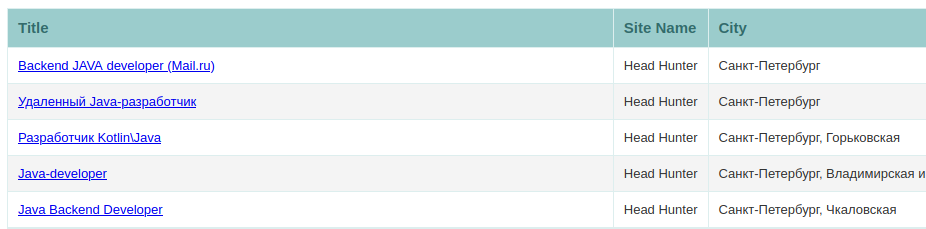

Job Aggregator
--------------

Initially, this is a task from JavaRush - [Java aggregator](https://javarush.ru/quests/lectures/questcollections.level08.lecture15)
(_CodeGym_ - [Java aggregator](https://codegym.cc/quests/lectures/questcollections.level08.lecture15))

Aggregate java vacancies in Saint-Petersburg from websites:
   - [HeadHunter](https://hh.ru/search/vacancy) - [HHStrategy](src/main/java/org/aggregator/job/model/strategy/HHStrategy.java)
   - [Хабр Карьера](https://career.habr.com/vacancies) - [CareerHabrStrategy](src/main/java/org/aggregator/job/model/strategy/CareerHabrStrategy.java)
   - [Работа.ру](https://www.rabota.ru/vacancy/) - [RabotaRuStrategy](src/main/java/org/aggregator/job/model/strategy/RabotaRuStrategy.java)

and generate file with HTML-table ([HtmlTemplateUtil](src/main/java/org/aggregator/job/util/HtmlTemplateUtil.java), [vacanciesTemplate.html](src/main/resources/templates/vacanciesTemplate.html)).
Information about vacancies processing is logged by a [LoggingInvocationHandler](src/main/java/org/aggregator/job/util/LoggingInvocationHandler.java)



---

### Requirements

- JDK 15+
- Gradle 7+

---

**Launch**
```
gradle run
```
